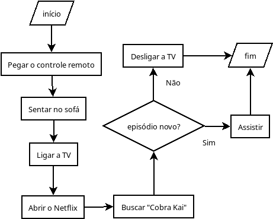

# 💻 Roteiro 2

## Exercício 1

Escolha uma atividade que você realiza na sua rotina e escreva um algoritmo para ela.

## Exercício 2

Desenhe um fluxograma para o algoritmo que você escreveu no exercício 1.

## Exercício 3 

Desenhe um fluxograma para o seguinte algoritmo:

**Algoritmo para escovar os dentes:**

1. Ir até a pia do banheiro;
2. Bochechar água;
3. Pegar a escova de dente;
4. Pegar a pasta de dente;
5. Colocar um pouco de pasta na escova;
6. Molhar a escova;
7. Escovar os dentes;
8. **Se os dentes ainda não estiverem limpos:** voltar ao passo 7;
9. **Senão:** ir ao passo 10;
10. Bochechar água;
11. Lavar a escova de dente;
12. Guardar a escova de dente;
13. Guardar a pasta de dente.

## Exercício 4 

Escreva o algoritmo que o fluxograma abaixo representa:

